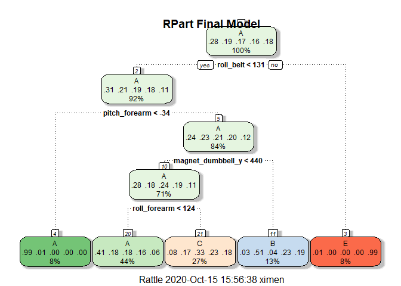

## Executive Summary

Using data collected from accelerometers, the goal of this project is to use machine learning algorithms learned from the *Practical Machine Learning Course* to predict "how (well)" a participant performed a certain exercise. 

Accelerometers were placed on the belt, forearm, arm, and dumbell of 6 participants. They were asked to perform barbell lifts correctly and incorrectly in 5 different ways [1]. The "classe" variable indicates the manner in which the participants performed the exercise, and it is categorized in 5 ways:

- A: exactly according to the specification
- B: throwing the elbows to the front
- C: lifting the dumbbell only halfway
- D: lowering the dumbbell only halfway
- E: throwing the hips to the front [1]

The algorithm built from the training set of the data is then applied to a final test set to predict the "classe" of 20 different test cases.

For more information on the dataset please visit: http://groupware.les.inf.puc-rio.br/har (see the section on the Weight Lifting Exercise Dataset).

## Loading & Cleaning the Data

First we will begin by loading necessary packges and the training and test sets of the data.

```r
library(caret)
library(rattle)
library(randomForest)
library(knitr)

set.seed(305) #set RNG seed; is used for entire analysis

training <- read.csv("https://d396qusza40orc.cloudfront.net/predmachlearn/pml-training.csv")
dim(training)
```

```
## [1] 19622   160
```

```r
testing <- read.csv("https://d396qusza40orc.cloudfront.net/predmachlearn/pml-testing.csv")
dim(testing)
```

```
## [1]  20 160
```

Both sets include 160 variables each, and the `training` set includes 19622 observations. After reviewing the data, there are many variables with a lot of NA/blank entries for almost all observations. Also, the first 7 columns only give information on the subjects, as well as timestamps. In order to clean the dataset, all of these variables will be removed, since they hold no predictive power on the `classe` variable. Columns with more than 95% NA entries and zero covariates will also be removed.


```r
#remove first seven columns
training <- training[,-c(1:7)]

#remove columns with more than 95% NA entries
training <- training[, which(colMeans(!is.na(training)) > 0.95)]
dim(training)
```

```
## [1] 19622    86
```

```r
#remove Near Zero Variance variables (zero covariates)
NZV_train <- nearZeroVar(training)
training <- training[, -NZV_train]
dim(training)
```

```
## [1] 19622    53
```

```r
#clean the test set in the same way
testing <- testing[,-c(1:7)]
testing <- testing[, which(colMeans(!is.na(testing)) > 0.95)]

#testing set has no zero covariates
nearZeroVar(testing)
```

```
## integer(0)
```

```r
#No further variables will be removed
dim(testing)
```

```
## [1] 20 53
```

The `training` set will be split further into a `TrainSet` to model the algorithm and a `TestSet` for testing. **The `testing` set will only be used for the final validation.**


```r
#partition the training set into TrainSet and TestSet
inTrain <- createDataPartition(training$classe, p=0.7, list=FALSE)

TrainSet <- training[inTrain,]
TestSet <- training[-inTrain,]
```

## Model Training

Using the caret package, three methods will be used to create three different models:
a) Classification Tree
b) Random Forest
c) Boosting

K-fold cross validation with k=5 folds will be used to evaluate each model's performance and to calculate the average prediction error rate.

Finally, a Confusion Matrix will be made for each model to determine its accuracy.

### a) Classification Tree


```r
set.seed(305)

#5 fold cross validation
train.control <- trainControl(method = "cv", number = 5)

#train Model 1
model1_tree <- train(classe~., data = TrainSet, method = "rpart", trControl = train.control)

#Print final model
fancyRpartPlot(model1_tree$finalModel, main = "RPart Final Model")
```

<!-- -->

```r
#Predict on TestSet
pred1_tree <- predict(model1_tree, newdata = TestSet)

#Accuracy measures
CM1 <- confusionMatrix(pred1_tree, TestSet$classe)
CM1$table
```

```
##           Reference
## Prediction    A    B    C    D    E
##          A 1525  470  481  453  141
##          B   22  376   29  165  148
##          C  120  293  516  346  294
##          D    0    0    0    0    0
##          E    7    0    0    0  499
```

```r
CM1$overall[1]
```

```
## Accuracy 
## 0.495497
```

With an accuracy of 49.5%, this model does not predict the `classe` very well. It is important to note that the model does **not** classify any outcome as **D classe**.

### b) Random Forest

**NOTE** The `randomForest()` function was used from the `randomForest` package due to the long runtime training with `method = "rf"` in the `caret` package. Due to this limitation, cross validation was not performed for the random forest model.


```r
#train Model 2
model2_forest <- randomForest(classe~., data = TrainSet)
print(model2_forest)
```

```
## 
## Call:
##  randomForest(formula = classe ~ ., data = TrainSet) 
##                Type of random forest: classification
##                      Number of trees: 500
## No. of variables tried at each split: 7
## 
##         OOB estimate of  error rate: 0.56%
## Confusion matrix:
##      A    B    C    D    E  class.error
## A 3903    3    0    0    0 0.0007680492
## B   13 2640    5    0    0 0.0067720090
## C    0   19 2376    1    0 0.0083472454
## D    0    0   26 2224    2 0.0124333925
## E    0    0    3    5 2517 0.0031683168
```

```r
#Predict on TestSet
pred2_forest <- predict(model2_forest, newdata = TestSet)

#Accuracy measures
CM2 <- confusionMatrix(pred2_forest, TestSet$classe)
CM2$table
```

```
##           Reference
## Prediction    A    B    C    D    E
##          A 1674    6    0    0    0
##          B    0 1133    9    0    0
##          C    0    0 1016    9    5
##          D    0    0    1  955    1
##          E    0    0    0    0 1076
```

```r
CM2$overall[1]
```

```
##  Accuracy 
## 0.9947324
```

The resulting in-sample out-of-bag (OOB) estimate of error rate was 0.54%. This is the error rate expected if the model was applied to a testing/validation dataset that was not used to train the model.

This second model also yielded an accuracy of 99.5%.

### c) Boosting


```r
set.seed(305)

#train Model 3
model3_boost <- train(classe~., data = TrainSet, method = "gbm", verbose = FALSE, trControl = train.control)

model3_boost$finalModel
```

```
## A gradient boosted model with multinomial loss function.
## 150 iterations were performed.
## There were 52 predictors of which 52 had non-zero influence.
```

```r
#Predict on TestSet
pred3_boost <- predict(model3_boost, newdata = TestSet)

#Accuracy measures
CM3 <- confusionMatrix(pred3_boost, TestSet$classe)
CM3$table
```

```
##           Reference
## Prediction    A    B    C    D    E
##          A 1650   32    0    1    1
##          B   13 1076   33    3    9
##          C    3   27  981   31   12
##          D    5    0   10  924   15
##          E    3    4    2    5 1045
```

```r
CM3$overall[1]
```

```
## Accuracy 
## 0.964486
```
This final gbm model yielded an accuracy of 96.4%.

## Conclusion

The accuracy of the three models are as follows:
a) Classification Tree Model: 49.5% 
b) Random Forest Model: 99.5%
c) Generalized Boosting Model: 96.4%

Therefore, the Random Forest Model will be used to predict the validation set `testing`. The following predictions will be used for the second part of the project, which consists of a quiz validating the prediction.


```r
pred_TEST <- predict(model2_forest, newdata = testing)
print(pred_TEST)
```

```
##  1  2  3  4  5  6  7  8  9 10 11 12 13 14 15 16 17 18 19 20 
##  B  A  B  A  A  E  D  B  A  A  B  C  B  A  E  E  A  B  B  B 
## Levels: A B C D E
```

### References

[1] Velloso, E.; Bulling, A.; Gellersen, H.; Ugulino, W.; Fuks, H. Qualitative Activity Recognition of Weight Lifting Exercises. Proceedings of 4th International Conference in Cooperation with SIGCHI (Augmented Human '13) . Stuttgart, Germany: ACM SIGCHI, 2013.
